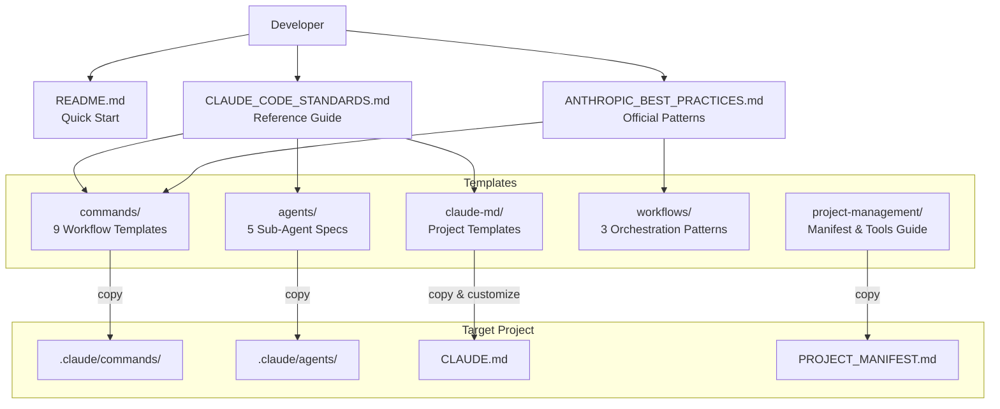

# Codebase Structure — ClaudeCodeStandards

## 1. Project Overview

**ClaudeCodeStandards** is a comprehensive reference guide and template collection for using Claude Code effectively as AI labor in software development. It provides reusable templates, best practices documentation, sub-agent specifications, and workflow patterns — all organized as Markdown files. This is not an executable application but a documentation and standards repository designed to be copied into and adapted for other projects.

- **Tech stack**: Markdown, JSON (configuration)
- **Architecture pattern**: Documentation repository with template-based composition
- **Current state**: Active reference material, regularly updated (integrates Opus 4.6 and Sonnet 4.6, February 2026)

## 2. Folder Structure

```
ClaudeCodeStandards/
├── .claude/
│   └── settings.local.json              # Claude Code permission configuration
├── templates/
│   ├── agents/                          # Sub-agent specialist templates
│   │   ├── code-reviewer.md             # Code quality analysis specialist
│   │   ├── documentation-writer.md      # Technical documentation generation
│   │   ├── refactoring-expert.md        # Code optimization and design patterns
│   │   ├── security-auditor.md          # Security vulnerability assessment
│   │   └── test-specialist.md           # Testing and TDD implementation
│   ├── claude-md/                       # CLAUDE.md project context templates
│   │   └── web-app.md                   # Web application template (Next.js 14, TypeScript)
│   ├── commands/                        # Reusable slash-command templates
│   │   ├── analyze.md                   # Code analysis workflow
│   │   ├── code-review.md              # Code review command
│   │   ├── estimate.md                  # Effort estimation workflow
│   │   ├── explore-plan-code-commit.md  # Official Anthropic development pattern
│   │   ├── feature-implementation.md    # Feature development workflow
│   │   ├── integrate-parallel-work.md   # Multi-agent integration
│   │   ├── tdd-workflow.md              # Test-driven development pattern
│   │   ├── troubleshoot.md              # Debugging and troubleshooting
│   │   └── workflow.md                  # General workflow template
│   ├── project-management/              # Project management templates
│   │   ├── COMMUNITY_TOOLS.md           # AI tool ecosystem overview (16K)
│   │   └── PROJECT_MANIFEST.md          # Project status and context preservation
│   └── workflows/                       # Complex workflow orchestration patterns
│       ├── checkpoint-driven-development.md    # Structured validation gates (14K)
│       ├── complex-feature-orchestration.md    # Multi-feature coordination (11K)
│       └── quality-assurance-pipeline.md       # QA and testing pipeline (14K)
├── ANTHROPIC_BEST_PRACTICES.md          # Official Anthropic engineering patterns (23K, 701 lines)
├── CLAUDE_CODE_STANDARDS.md             # Complete reference standards (44K, 1237 lines)
├── README.md                            # Project overview and quick start (9.1K)
└── LICENSE                              # MIT License
```

**Notable structural decisions**:
- No package manifests, build configs, or executable code — purely a reference/template repo
- Templates are organized by usage context (agents, commands, workflows, project-management)
- Two main reference documents at root level cover standards and Anthropic best practices separately

## 3. Entry Points & Execution Flow

This project has no executable entry point. It is consumed as reference material:

1. **README.md** — Primary user entry point; overview, quick start, and usage examples
2. **CLAUDE_CODE_STANDARDS.md** — Authoritative standards document (1,237 lines); covers principles, methodologies, configuration, and advanced techniques
3. **ANTHROPIC_BEST_PRACTICES.md** — Official Anthropic patterns (701 lines); extended thinking, workflows, sandboxing, multi-agent architecture

**Intended usage flow**:
1. Clone or copy the repository
2. Copy relevant `CLAUDE.md` template to your project root
3. Copy command templates to `.claude/commands/`
4. Copy agent templates to `.claude/agents/` (if using sub-agents)
5. Create `PROJECT_MANIFEST.md` from the template for session continuity
6. Reference the standards and best practices documents as needed

## 4. Core Modules & Components

### A. Standards Documentation (root-level files)

| File | Purpose | Size |
|------|---------|------|
| `CLAUDE_CODE_STANDARDS.md` | Comprehensive reference covering core principles, prompt engineering, AI labor methodology, configuration, version control, quality, and advanced techniques | 44K, 1237 lines |
| `ANTHROPIC_BEST_PRACTICES.md` | Official Anthropic patterns: adaptive thinking, Opus 4.6/Sonnet 4.6 capabilities, workflow patterns, sandboxing, multi-agent architecture | 23K |
| `README.md` | Project overview, quick start, key concepts, usage examples | 9.1K |

### B. Sub-Agent Templates (`templates/agents/`)

Five specialized AI agent specifications for multi-agent workflows:

| Agent | Purpose | Key Capabilities |
|-------|---------|-----------------|
| `code-reviewer.md` | Code quality analysis | SOLID principles, security review, performance analysis |
| `test-specialist.md` | Testing and TDD | Test strategy design, coverage analysis, debugging |
| `security-auditor.md` | Security assessment | OWASP Top 10, threat modeling, compliance |
| `refactoring-expert.md` | Code optimization | Design patterns, technical debt, performance |
| `documentation-writer.md` | Documentation generation | API docs, user guides, architecture docs |

### C. Command Templates (`templates/commands/`)

Nine reusable workflow command templates:

| Command | Purpose |
|---------|---------|
| `explore-plan-code-commit.md` | Official Anthropic 4-phase workflow: Explore, Plan, Code, Commit |
| `tdd-workflow.md` | 6-phase TDD pattern with sub-agent integration |
| `feature-implementation.md` | Feature development workflow |
| `code-review.md` | Comprehensive code review process |
| `analyze.md` | Code analysis workflow |
| `estimate.md` | Effort estimation |
| `troubleshoot.md` | Debugging and problem diagnosis |
| `integrate-parallel-work.md` | Merging parallel development streams |
| `workflow.md` | General workflow template |

### D. Workflow Templates (`templates/workflows/`)

Three complex orchestration patterns:

| Workflow | Purpose | Size |
|----------|---------|------|
| `checkpoint-driven-development.md` | Structured validation gates (Architecture, Implementation, Testing, Integration, Pre-Release, Production) | 14K |
| `complex-feature-orchestration.md` | Multi-domain feature coordination with parallel specialist analysis | 11K |
| `quality-assurance-pipeline.md` | 5-stage QA pipeline from pre-development through post-production monitoring | 14K |

### E. Project Management Templates (`templates/project-management/`)

| Template | Purpose |
|----------|---------|
| `PROJECT_MANIFEST.md` | Session-to-session context preservation with status tracking, implementation tracking, and restoration protocol |
| `COMMUNITY_TOOLS.md` | AI development tool ecosystem guide (Aider, Cursor, Windsurf, Crystal, Devin, etc.) |

## 5. Data Models & State Management

This project defines no runtime data models. It establishes **template schemas** for other projects:

- **Project Manifest Schema** (`PROJECT_MANIFEST.md`): Tracks project status, architecture, implementation progress, technical context, quality metrics, and session restoration data
- **CLAUDE.md Configuration Schema** (`web-app.md`): CONTEXT framework — Clear instructions, Operational processes, Naming standards, Testing gates, Examples, Expectations, Tools
- **Command Signal System**: Structured markers (`[IMPLEMENT]`, `[REVIEW]`, `[DEBUG]`, `[TEST]`, `[CHECKPOINT]`, `[RESTORE]`) for AI-to-AI and human-to-AI coordination
- **Extended Thinking Budgets**: 4K ("think"), 10K ("think hard"), 32K ("ultrathink"), 64K (extended) token allocations

No databases, migrations, or persistent state management.

## 6. API & External Integrations

This repository has no direct external integrations. It **documents** integration patterns for other projects:

| Integration | Purpose | Where Documented |
|-------------|---------|-----------------|
| Anthropic API | Claude Code, extended thinking, MCP | `ANTHROPIC_BEST_PRACTICES.md` |
| GitHub | Repository management, CI/CD, code review | `ANTHROPIC_BEST_PRACTICES.md` |
| MCP Servers | Database, monitoring, communication tool access | `ANTHROPIC_BEST_PRACTICES.md` |
| Git Worktrees | Parallel Claude development sessions | `CLAUDE_CODE_STANDARDS.md` |

### Claude Code Permission Configuration (`.claude/settings.local.json`)

Allowed operations:
- `WebFetch` for `docs.anthropic.com`, `code.claude.com`, `www.anthropic.com`, `github.com`, `raw.githubusercontent.com`, `www.reddit.com`
- `Bash` for `mkdir`, `git add`, `git push`, `git commit`
- `WebSearch`

## 7. Internal APIs / Exposed Endpoints

Not applicable. This is a documentation repository with no server, routes, or endpoints.

## 8. Configuration & Environment

| File | Purpose | Required |
|------|---------|----------|
| `.claude/settings.local.json` | Claude Code permissions (WebFetch domains, Bash commands) | Optional |

No environment variables, secrets, or environment-specific configuration files exist. The repository is designed as a clean, public-safe reference.

## 9. Workflows & Business Logic

### Workflow 1: Explore-Plan-Code-Commit (Official Anthropic Pattern)

1. **Phase 1 — Exploration**: Read files, understand patterns, use subagents for complex investigation
2. **Phase 2 — Planning**: Use extended thinking ("think hard"), create implementation plan, document decisions
3. **Phase 3 — Implementation**: Follow the plan, verify incrementally, handle deviations
4. **Phase 4 — Commit & Document**: Create quality commit, update documentation, create PR

### Workflow 2: Test-Driven Development (TDD)

1. Write comprehensive tests first (no implementation code)
2. Verify tests fail appropriately
3. Commit tests separately
4. Implement minimal code to pass tests
5. Run full test suite, code quality review, integration verification
6. Commit implementation

### Workflow 3: Checkpoint-Driven Development

Structured validation gates with 6 checkpoint types:
1. **Architecture Checkpoint** — System design validation
2. **Implementation Checkpoint** — Code quality gates
3. **Testing Checkpoint** — Test coverage and quality
4. **Integration Checkpoint** — Component integration validation
5. **Pre-Release Checkpoint** — Production readiness certification
6. **Production Checkpoint** — Post-deployment monitoring

Each checkpoint has pre-tasks, validation checklists, deliverables, specialist reviews, and exit criteria.

### Workflow 4: Quality Assurance Pipeline

5-stage pipeline:
1. Pre-development quality planning (standards, strategy, security gates, metrics)
2. Development-time continuous validation (monitoring, parallel testing, security)
3. Integration quality validation (assessment, testing, quality gates)
4. Pre-production quality certification (audits, certification, clearance)
5. Post-production quality monitoring (metrics, incident response, improvement)

### Workflow 5: Complex Feature Orchestration

Multi-agent coordination for complex features:
1. Discovery and planning with parallel specialist analysis
2. Architecture and design coordination
3. Implementation coordination with continuous quality
4. Integration with comprehensive validation
5. Deployment with monitoring and documentation

## 10. Dependencies

**Runtime dependencies**: None (documentation project)

**System-level dependencies**:
- Git (for version control)
- Claude Code CLI (for consuming templates)
- Any Markdown viewer/editor

**No package manifests, no language-specific dependencies.**

## 11. Error Handling & Logging

Not applicable as executable code. The standards document establishes these **recommended patterns** for other projects:

- **Transparent Error Handling**: All errors displayed, no silent failures
- **Actionable Errors**: Clear, specific, helpful error messages
- **Structured Logging**: JSON format preferred; standard levels (ERROR, WARN, INFO, DEBUG, TRACE)
- **PII Protection**: Sensitive data excluded from logs

## 12. Testing

No test suites exist in this repository. The standards document recommends:

- **Frameworks**: Jest, pytest, Playwright, Cypress, JUnit, xUnit
- **Coverage target**: 80% minimum, 95%+ for critical paths
- **Testing approach**: TDD with dedicated test-specialist sub-agent
- **Test types**: Unit, integration, E2E

## 13. Build, Deploy & DevOps

No build process, deployment pipeline, or DevOps configuration exists. The repository recommends:

- **CI/CD**: GitHub Actions with `anthropics/claude-code-action@v1` for issue triage and code review
- **Sandboxing** (October 2025): Filesystem and network isolation via `--sandbox-root`
- **Safe YOLO Mode**: `--dangerously-skip-permissions` with sandbox isolation for automation
- **Multi-interface deployment**: CLI, VS Code Extension, Web Interface, MCP Server mode

## 14. Security Considerations

The repository itself contains no secrets, credentials, or security-sensitive code. Security recommendations for consuming projects:

- OWASP Top 10 vulnerability assessments via security-auditor sub-agent
- Sandboxing with filesystem and network isolation
- Permission whitelist approach in `.claude/settings.local.json`
- No hardcoded credentials; environment variable management
- Dependency vulnerability scanning

## 15. Architecture Diagram (Mermaid)



## 16. Key Observations & Recommendations

### Observations

- **Well-organized**: Clear separation between standards documentation, templates, and configuration
- **Comprehensive coverage**: 20+ template files covering agents, commands, workflows, and project management
- **Actively maintained**: Recent commits integrate Claude Sonnet 4.5 capabilities and 2025 updates
- **Clean repository**: No orphaned files, no credentials, MIT licensed for public sharing

### Potential improvements

- **No automated validation**: No tests or linting to verify Markdown structure, broken links, or template consistency
- **Single CLAUDE.md template**: Only `web-app.md` exists; additional templates for Python backends, CLI tools, data pipelines, or mobile apps would broaden applicability
- **No versioning scheme**: No changelog or semantic versioning to track template evolution
- **Large monolithic documents**: `CLAUDE_CODE_STANDARDS.md` (1,237 lines) and `ANTHROPIC_BEST_PRACTICES.md` (701 lines) could benefit from modular splitting for easier consumption
- **Community tools document may go stale**: `COMMUNITY_TOOLS.md` references specific tool versions and market positions that change rapidly
- **No usage examples with real output**: Templates show structure but lack worked examples showing actual Claude Code sessions using them
